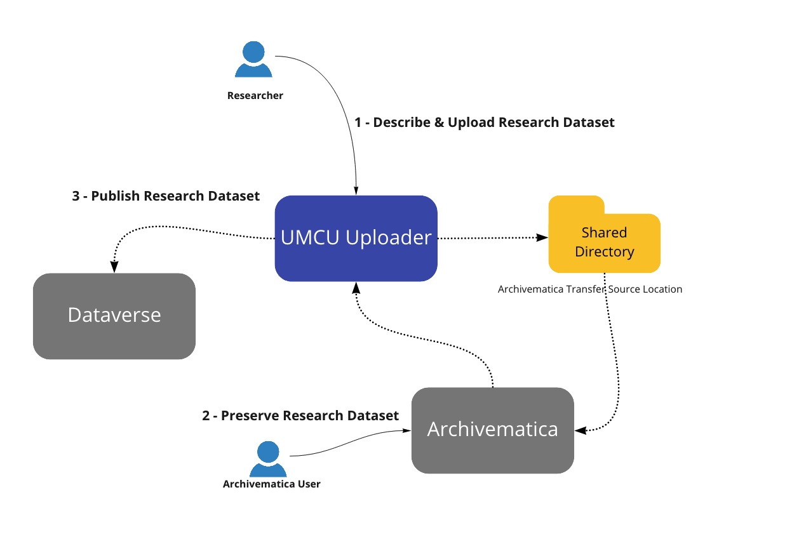

# UMCU Uploader

The UMCU Uploader is an application for describing research data sets, preserving them in 
[Archivematica](https://github.com/artefactual/archivematica/) and publishing them with [Dataverse]( 
https://github.com/IQSS/dataverse).

The University Medical Centre Utrecht (UMCU) sponsored the development of this application to 
further the objectives of [Open Science](https://en.unesco.org/science-sustainable-future/open-science) and [FAIR](https://www.force11.org/group/fairgroup/fairprinciples) 
(Findable, Accessible, Interoperable, Reusable) research data management. 

The application is currently a minimum viable product to provide an end to end process that can be tested with real data sets. 

## License

[Apache License Version 2.0](https://github.com/artefactual-labs/umcu-uploader/blob/main/LICENSE)
Copyright Artefactual Systems Inc (2021)

See [CONTRIBUTING](CONTRIBUTING.md) for guidelines on how to contribute to the project.

## Overview

The UMCU Uploader is a web-based application that is built using the Python [Flask](https://pypi.org/project/Flask/) framework. It has been
tested using Python 3.6.9.



### 1 - Describe and Upload Research Dataset 
* Researchers upload a directory of files containing the research data 
* Metadata describing the dataset is added (title, description, related publications, and so on)
* Access rights are assigned to all of the files in the dataset (Public, Restricted or Private)

### 2 - Preserve Research Dataset 
* Metadata is stored in a metadata.json file in a metadata directory (using a standard Archivematica format) 
* The dataset is copied to the Archivematica Transfer Source Directory 
* An Archivematica user can then select the Transfer for transfer and ingest processing in Archivematica, which will create an Archival Information Package (AIP) 

### 3 - Publish Research Dataset 
* The user provides the AIP UUID in the UMCU Uploader application 
* The Uploader will retrieve the AIP from Archivematica (using the Archivematica API) 
* The Uploader will then select files from the AIP that have Public or Restricted Access Rights (any files classified as Private are not published) 
* The Uploader will then upload the dataset to Dataverse (using the Dataverse API) 
* The research data manager will review and approve the dataset before it is visible to public users 


## Installation

### Installing without Poetry
For versions of python older than 3.7 (And without installing Poetry), follow these instructions:

<ol>
<li>
Clone files and cd to directory:

```bash 
$ git clone https://github.com/artefactual-labs/umcu-uploader.git && cd umcu-uploader
```
<li>
Clone submodules:

```bash
$ git submodule update --init --recursive
```
<li> 
Set up virtualenv in the project root directory:

```bash
$ virtualenv -p python3 venv
```

<li> 
Activate virtualenv:

```bash
$ source venv/bin/activate
```


<li>Install requirements:

```bash
$ pip install -r requirements/base.txt
```
<li>
In a terminal window, start the Flask server:

```
$ python run.py
```
<li>
The application runs on HTTP port 5000. Confirm that the Flask server and application are up and running at

`localhost:5000` in your browser.
</ol>

### Install with Poetry
<ol>
<li> Install Poetry

Follow the instructions [here](https://python-poetry.org/docs/#installation).

<li> Clone files and cd to directory:

```bash
$ git clone https://github.com/artefactual-labs/umcu-uploader.git && cd umcu-uploader
```

<li> Clone submodules:

```bash
$ git submodule update --init --recursive
```

<li> Activate virtualenv:

```bash
$ poetry shell
```

<li> Install requirements:

```bash
$ poetry install
```

<li> In a terminal window, start the Flask server:

```
$ poetry python run.py
```

<li> The application runs on HTTP port 5000. Confirm that the Flask server and application are up and running at

`
localhost:<Port>
`
in your browser.

</ol>

## Configuration
Configuration is specified, using YAML, either in `.config.yaml` in the
application directory or in `/etc/umcu-uploader.yaml`. The various
configuration settings are detailed below:


| Setting                            | Description                                                          | Default                              |
| ---------------------------------- | -------------------------------------------------------------------- | ------------------------------------ |
| host                               | Host to run app on                                                   | 0.0.0.0                              |
| port                               | HTTP port to listen on                                               | 5000                                 |
| debug                              | If `True`, run with built-in debugger                                | False                                |
| secret_key                         | Key used to sign cookies[1]                                          | you-shall-not-pass🧙<200d>♂️          |
| data_directory                     | Directory in which use files will be stored                          | *system temp directory*              |
| transfer_source_directory          | Archivematica transfer source directory                              | *none*                               |
| dataverse_server                   | Dataverse server to upload to                                        | https://dataverse.nl/dataverse/      |
| dataverse_demo_server              | Demo Dataverse server to upload to                                   | https://demo.dataverse.nl/dataverse/ |
| dataverse_api_key                  | Dataverse API key                                                    | *none*                               |
| demo_mode                          | If `True`, run using demo Dataverse server                           | True                                 |
| depositor_name                     | Name of depositor                                                    | ANON                                 |
| divisions                          | Division-specific Archivematica transfer source directories, etc.[2] | *none*                               |
| storage_server_url                 | Archivematica Storage Server URL                                     | *none*                               |
| storage_server_user                | Archivematica Storage Server username                                | *none*                               |
| storage_server_api_key             | Archivematica Storage Server API key                                 | *none*                               |
| storage_server_basic_auth_user     | Archivematica Storage Server basic auth user                         | *none*                               |
| storage_server_basic_auth_password | Archivematica Storage Server basic auth password                     | *none*                               |


[1] Cookie signing details: https://stackoverflow.com/questions/22463939/demystify-flask-app-secret-key

[2] The configuration values are single values, except for the `divisions` field.

Example value of the `divisions` setting:

```
---
divisions:
  ed:
    name: Example Division
    transfer_source_directory: /path/to/directory
  ...
```


## Deployment

A fairly simple way of deploying the app is to proxy it through Nginx. This
allows the app to be accessed via TLS/SSL, basic access authentication, etc.

Instructions for deploying using uWSGI proxied through Nginx:

<ol>
<li> Add, to the server block of an Nginx configuration, directives to proxy to WSGI:

```
location = /uploader { rewrite ^ /uploader/; }
location /uploader { try_files $uri @uploader; }
location @uploader {
  uwsgi_pass unix:/tmp/uploader.sock;
  include uwsgi_params;
}
```

 <li> Run the app using the included config file:

```
$ uwsgi uploader.ini
```
</ol>
